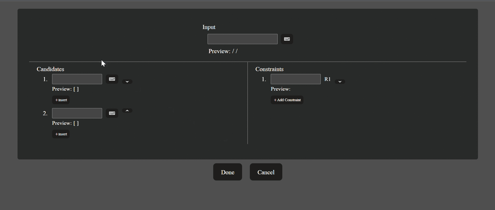
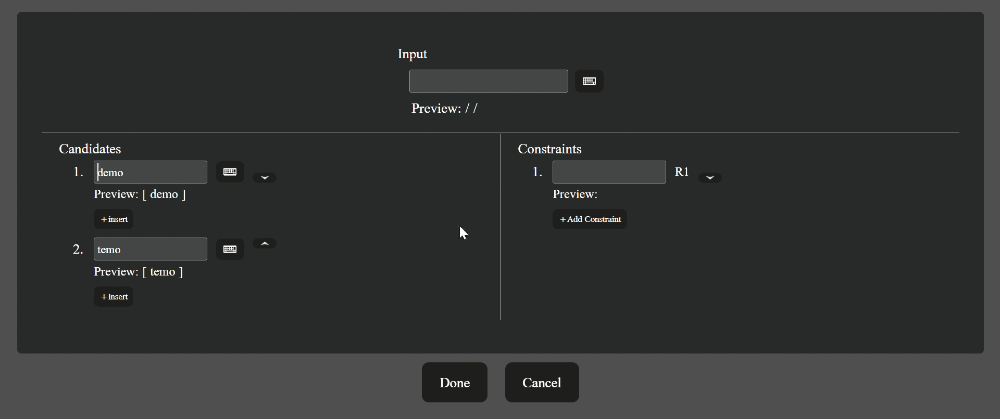

# Tableau Generator (最適性理論 タブロー自動生成アプリ)[^1]

## 目次
| 番号 | 項目 |
|:-:|:--|
| 1 | [URL](#1url) |
| 2 | [概要](#2概要) |
| 3 | [開発環境と主な使用技術](#3開発環境と主な使用技術) |
| 4 | [主要機能](#4主要機能) |
| 5 | [工夫した点](#5工夫した点)

***
## 1．URL
以下のURLからアクセス可能です(独自ドメインの取得はおこなっておりません)。

https://elaborate-lamington-27ccee.netlify.app

***
## 2．概要
言語学の音韻理論分野において米国を中心に盛んな研究がおこなわれている最適性理論(Optimality Theory)のタブロー(表)をリアルタイムで生成するWebアプリケーションです。

生成されたタブローはxlsxファイル形式でダウンロードするか、LaTeXコードを発行することで研究活動や論文執筆に活用することができます。

タブローのLaTeXコードを生成するアプリケーションとしては簡易的なものが既に存在しますが、本アプリケーションは以下のような点において既存のアプリケーションとは異なります。

+ 実際に論文等で使用される形式のタブローを画面上に表示しながら編集することが可能
  + 既存アプリは必要事項を入力してLaTeXコードを生成したあと、LaTeXファイルを作成してコンパイルすることではじめて生成されたタブローを確認することができるというもの
+ SPAであるため画面の遷移なしにリアルタイムでタブローの変更を画面に反映することが可能
+ 基本的な制約に関しては自動的に評価を行い、評価結果をタブローに反映することが可能
  + 既存アプリでは評価結果を自身ですべて手打ちする必要がある

***
## 3．開発環境と主な使用技術
OS
+ Windows 11 (WSL2 Ubuntu-20.04.4)

フレームワーク
+ Vue.js 3.2

主な使用言語
+ Typescript 4.8.4
+ Sass 1.54.0

ビルドツール
+ Vite 3.2.37

テストツール
+ Vitest  0.24.0

パッケージマネージャ
+ Yarn 1.22.15

その他
+ Eslint 8.22.0
+ Prettier 2.7.1
+ Husky 8.0.1

***
## 4．主要機能
+ 入力、出力候補、制約(任意の名前)を設定してタブローを作成、編集する(Manualモード)
+ 入力、出力候補、制約(選択画面内のもの)を設定してタブローを作成、編集する(Automaticモード)
  + 以下参考画像はManualモードのもの(画面右下のボタンでモード切替)

+ 作成したタブローのLaTeXコードを生成する

+ 作成したタブローをxlsxファイルでダウンロードする

+ 各音素の弁別素性を任意の値に設定する

+ 画面上での音声記号入力

+ 入力内容のバリデーション

***
## 5．工夫した点
+ 以下のように処理の種類に応じてファイルを明確に区別することで、本質的に無関係な処理同士が過度に依存することを避けるよう心がけました。ドメインやリポジトリにおける処理はstoreを経由して実行されますが、storeはあくまでもそれらのインターフェースに依存しているに過ぎないため、ドメインやリポジトリの実装が変更されたとしてもstore内では問題が生じないようになっています。

  + グローバルな状態管理など => src/store配下の各ファイル
  + タブローやタブローに属するinput, candidate, constraintなどに関する処理、制約の評価アルゴリズム => src/domains配下のドメインエンティティ、バリューオブジェクトファイル(storeを経由)
  + タブローの一括操作(ダウンロード処理) => src/domains配下のドメインサービスファイル(tableauService.ts)
  + ローカルストレージへのデータ保存、ロードなど =≻ src/repository配下のリポジトリファイル(storeを経由)
  + UIに関する処理 => 各コンポーネントのvueファイル
  + 音素や制約の名称や説明など、不変の情報に対する簡易的な処理 => src/consts配下の各ファイル

***
[↑目次へ](#目次)

[^1]: 最適性理論に関する基本情報(入力、出力、制約、候補、評価、違反などの概念)についてはWikipedia([日本語版](https://ja.wikipedia.org/wiki/%E6%9C%80%E9%81%A9%E6%80%A7%E7%90%86%E8%AB%96), [英語版](https://en.wikipedia.org/wiki/Optimality_Theory))などをご参照ください。
